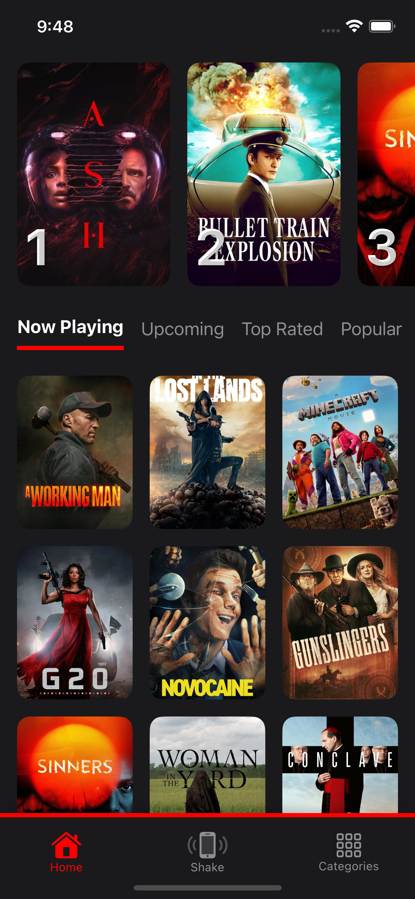
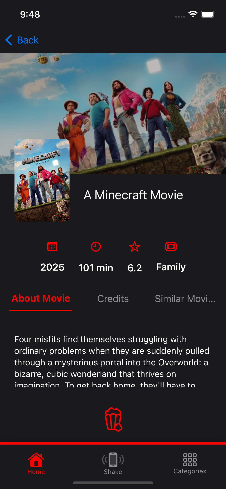
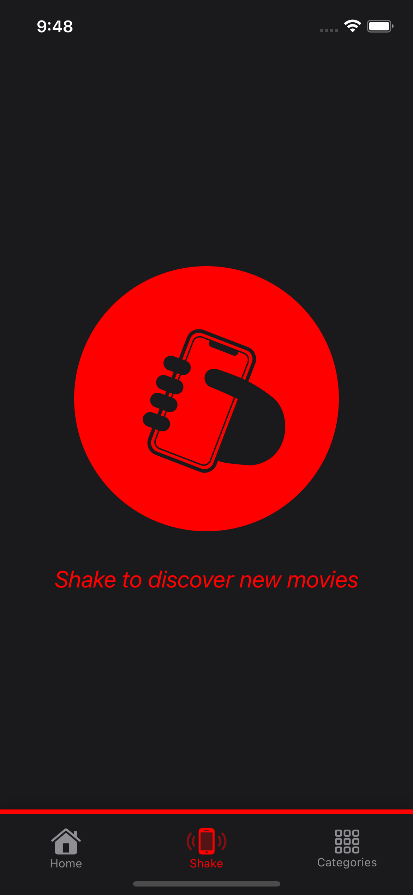
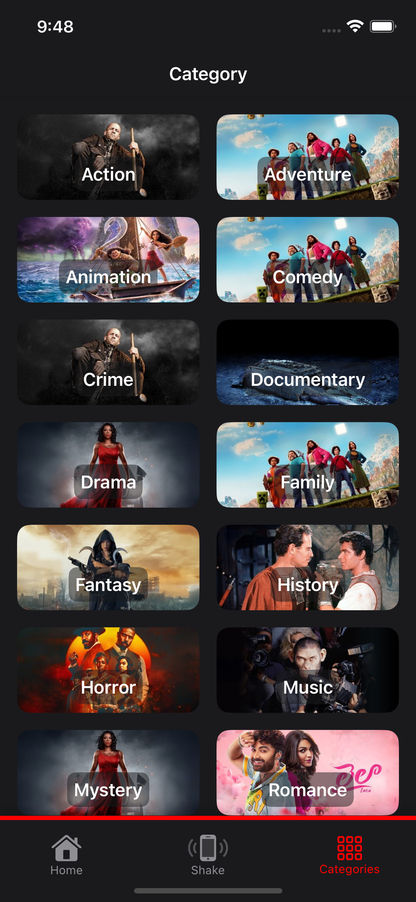

# 🎬 MovieShaker

MovieShaker is a fun iOS app that helps you discover movies randomly. Powered by the TMDb API, it features a modern SwiftUI interface and lets you shake your device to get a movie recommendation.

## 🚀 Features

- 📱 Sleek SwiftUI design
- 🔄 Shake gesture to get a random movie
- 🔍 Movie search and detailed info
- 🌙 Dark mode support

## 📸 Screenshots

### 🏠 App Icon


### 🏠 Home Screen


### 🎞️ Movie Detail


### 🔎 Shake Screen


### 🔎 Category Screen


## 🛠️ Installation

```bash
git clone https://github.com/yourusername/MovieShaker.git
open MovieShaker/MovieShaker.xcodeproj
